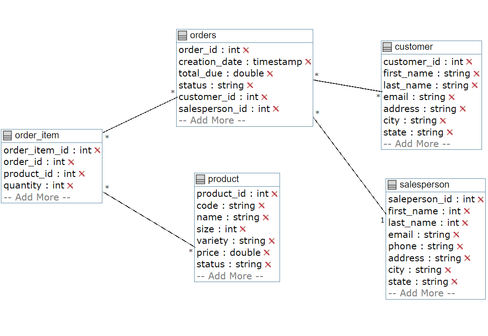

# Java JDBC App
## Introduction
In Java, JDBC is the most common technology for accessing relational database from a relational database
management system (RDMBs).

This JDBC app, allows user to connect with PostgreSql database and implement CRUD functionality using 
Data Access Object(DAO) design pattern. This app uses Maven as project management tool, the basic flow is that the application
will mount the driver and using that driver will create a connection, from that connection, SQL statement can be executed, then we can
either commit those changes if there were any or roll back and then close the connection.  
## ER Diagram

## Design Pattern 
This app uses Data Access Object (DAO) pattern, it provides an abstraction layer between JDBC code and rest of the code, 
specifically business logic, and a clear separation of concerns in the code. the output and input of a single DAO should be
a single DTO and all of its child objects. For example, in `customer`, customer DAO will respond to that entire data domain, 
that `customer` itself with all of its values(phone, address, name etc).

The difference between DAO and repository is that DAO can support multiple tables, where repository focus on single 
table, in repository pattern you join in the code, instead of database, so we need to `SELECT` everything from `orders` 
and get the `customer_id`, then go to `customer` and find customer by id to join it in code, where in DAO, we can join 
`orders` and `customer` table by existing foreign key. 
 
  