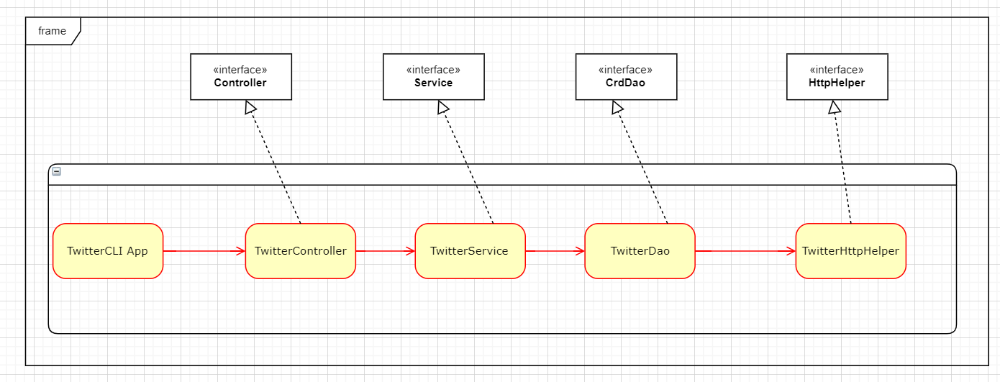

# TwitterCLI  App
## Introduction
This Twitter App is a simple Java App which can post/show/delete Twitter post via Twitter REST API. This app is 
designed via MVC design pattern, it consists of Model, Controller, Service and DAO layers, and the dependency is shown as 
the diagram.

In this app, we used multiple libraries to help the implementation which are HTTP client for API connection, JSON 
serializer for JSON parsing and JUint & Mockito for testing, and Maven is used for project managements. 

## Design 

1. `TwitterHttpHelper` : HttpHelper is used to build connection between Twitter API and the app using OAuth 1 protocol, it is 
responsible for executing HTTP with given URI and authorizes the HTTP request using Twitter Secret. 
2. `TwitterDAO` : TwitterDAO constructs Twitter API URIs and make HTTP calls using `HtppHelper`, it implements three 
methods `create`, `findById` and `deleteById`
3. `TwitterService` : TwitterService handled the business logic of the application, it basically validate the 
text length, tweet coordinate and ID format, then return Twitter Object using `TwitterDao`
4. `TwitterController` : TwitterController consumes user input and calls the corresponding `TwitterService` method. 
it first validate user input and then parse argument. 
5. `TwitterCLIApp` : this is where all components are declared and instantiated, and call `run` method which calls
controller methods and print tweets

## Quick Start
In order to run the app, you have to set up some environment variables for OAuth and package
the project using Maven.
In order to build the project
you need to type `mvn package` 
in order to run the project type `java -cp target/twitter-1.0-SNAPSHOT.jar "your arguments`

###Usage
1. POST A TWEET
    in order to post a tweet, user need to type:
    `post "text you want to post" "latitude:longitude"`
2. SHOW 
    in order to search for a tweet, user need to type: 
    `show "tweet_id"` 
3. DELETE
    in order to delete a tweet, user need to type:
    `delete "tweet_id1,tweet_id2,tweet_id3......"`

## Model 
From Twitter API, we get a HttpResponse which contains all properties in JSON format as shown below.
```aidl
    //Simplified Tweet Object 
    {
       "created_at":"Mon Feb 18 21:24:39 +0000 2019",
       "id":1097607853932564480,
       "id_str":"1097607853932564480",
       "text":"test with loc223",
       "entities":{
          "hashtags":[],      
          "user_mentions":[]  
       },
       "coordinates":null,    
       "retweet_count":0,
       "favorite_count":0,
       "favorited":false,
       "retweeted":false
    }
```
and we created 5 classes `Tweet`,`Entities`, `Coordinates`, `Hashtag` and `UserMention` to construct the tweet object.

## Improvements 
1: Delete and Find tweet not only by IDs, but some other properties that is easy to remember.
2: Diversify the post content, not only post text message, but also pictures or videos.
3: 
