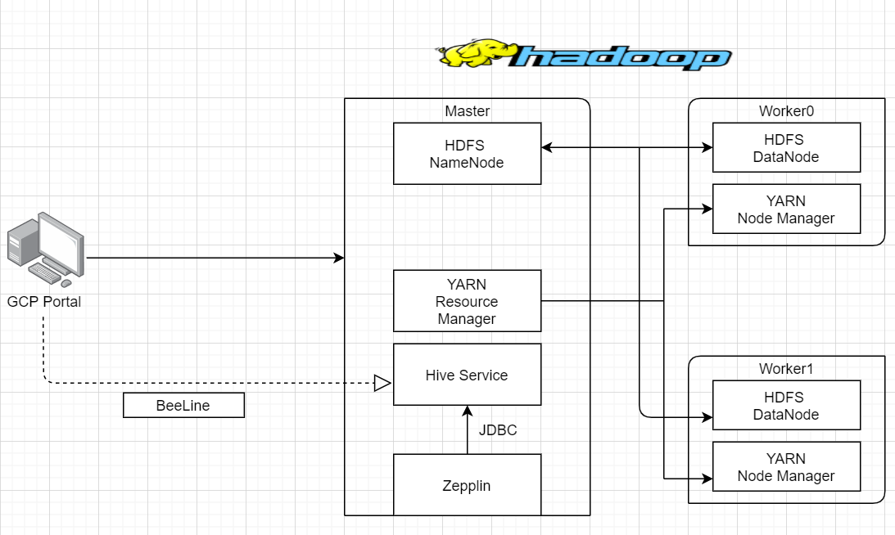

# Hadoop Hive Project
## Table of Content
- [Introduction](#Introduction)
- [Hadoop Cluster](#Hadoop-Cluster)
- [Hive Project](#Hive-Project)
- [Improvements](#Improvements)

## Introduction
This Hadoop project is focusing on evaluate Core Hadoop Components, including HDFS, 
MapReduce and YARN. Apache Hive and Zeppelin NoteBook are used to process those data and solve some real business analytics problems. 

 A one mater node, two work nodes cluster is built in Google Cloud Platform working as a Hadoop Cluster, and the "big data" that is 
 used for this project is the World Development Indicators(WDI) DataSet from Google Storage.
 
## Hadoop Cluster
The Hadoop Cluster used for this project is 3 nodes cluster, contains one master and two workers node which are hosted by Google Cloud Platform.
MasterNode also known as NameNode maintains and manages WorkerNode(DataNodes), it records the metadata of all files stored in the cluster as well.
2 DataNodes are the nodes that store actual data. All 3 nodes have 2vCPUs, 12GB of RAM, and 100GB of storage.  
 The Architecture is shown below.  
  

- HDFS stands for Hadoop distributed file system, HDFS is a distributed file system that handles large data sets running on commodity hardware. It is used to scale a single Apache Hadoop cluster to hundreds
 (and even thousands) of nodes,  allows you to store a large number of files across different node. In this project, 2 dataNodes located 
 in worker machines store the actual block of data, where the nameNode located in master machine manages and maintain those
two dataNodes.  

- YARN is the resource management and job scheduling technology in the Hadoop framework, YARN has a global resource manager and
per-application Application Master, Resource Manager and Node Manager form the data-computation framework, they are in a master/slave relationship,
Both RM and NM are instances of JVM. Node Managers are running on worker machines that monitor containers compute resources, the Application Master
can schedule an application based on the compute resources availability of each node. AM is responsible for coordinating all the 
containers to perform distributed tasks. 

- ZEPPLIN is a web base notebook that enables data-driven, interactive data analytics and collaborative docomuents with SQL, HQL, SCALA and more,
it is easier to mix languages in the same notebook. In our project, we use Beeline to connect to a Hive instance via JDBC, but using Beeline it is 
hard to manage the HiveQL code, using Notebook like Zepplin allows user to edit, storage and excute HiveQL code. 

- Hive is a SQL-like query language that can process large dataSets stored in HDFS, Hive can convert SQL to execution engine like MapReduce, Spark or Apache Tez.
In this project, we write HiveQL to process and analyze the WDI DataSets, and explore some HQL key features like SerDe, Partition, Columnar file and more.

## Hive Project
discuss purpose and what you have done
post Zeppelin Note
## Improvements
1. Adding additional work nodes, to compare the performance differences between different active work nodes. 
2. After exploring `partition`, try exploring `buckets` to check the performance. 
3. Compare different columnar file format other than `Parquet`. 