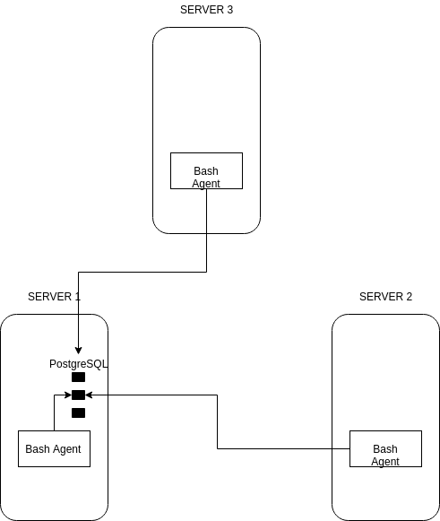

# Linux Cluster Monitoring Agent

## Introduction

Cluster Monitor Agent is an internal tool that monitors the clsuter resources, there are in total of 10 ndoes which are running centos7. The hardware specification and real time resources
usage for each node will be collected and stored in a RDBMS database for further analyze.

## Architecture 

As the diagram shown, hardware specification and resources usage in each node will be collected by psql database which will be located in server 1/
## Usage 

In this Directory, there are 6 files in total.
1) README.md : the high level architecture for the linux/sql project and the explaination for the other files
2) host_info.sh : a bash script that collects host hardware info and insert it into database.
3) host_usage.sh : a bash script that collects current hsot usage like CPU and memory and then insert into the database, this script will run once every minute. 
4) psql.docker.sh : a bash script that start/stop psql instance using docker container. 
5) sql/ddl.sql : a sql script that will automate the database initialization.
6) sql/queries.sql : a sql script that collectes information from the cluster database to better manage the cluster and plan the future resources.

## Improvements 

During the implements, as a developer, i noticed there are a few potential improvements that can be further developed.
1) Back up Database : in case of database break down in server 1, there should be one or more backup databases in other nodes to ensure data security and integrity.
2) Simplify start up process : there should be a automation scripts for all the processes, from docker initialization to table creation and data insertion.
3) Additional Queries : there should be more queries about the usage info.
